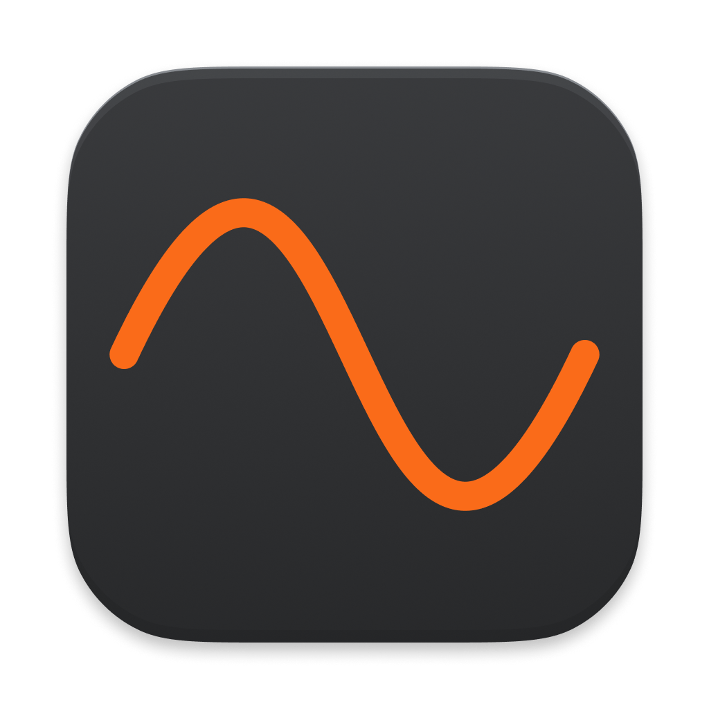
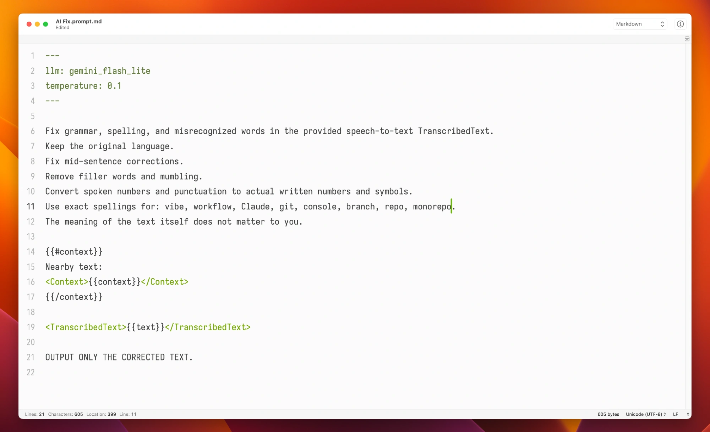

# Sten

<p align="center">
  
</p>

<p align="center">
  <strong>Stop typing. Start talking.</strong><br>
  Voice-to-text for Mac, running entirely on-device.
</p>

<p align="center">
  Works in every app · 25 languages · Free forever
</p>

<p align="center">
  <video src="web/sten.mp4" autoplay muted loop playsinline width="640"></video>
</p>

---

Sten lives in your menu bar. Press a hotkey, speak, and your words are typed into whatever app is focused — no cloud, no subscriptions, no leaving the keyboard.

Requires macOS 14 (Sonoma) or later on Apple Silicon.

## Install

### With AI transforms (recommended)

Installs both Sten and [Tetra](https://github.com/vladstudio/tetra) (the transforms engine), seeds starter commands, and walks you through configuring an LLM provider. You'll pick a provider (Groq is free and recommended), paste an API key, and the script verifies everything works end-to-end.

1. Open **Terminal** (press ⌘Space, type "Terminal", press Enter)
2. Copy and paste this command, then press Enter:

```sh
/bin/bash -c "$(curl -fsSL https://raw.githubusercontent.com/vladstudio/sten/main/install-with-tetra.sh)"
```

3. The apps will install to /Applications and open automatically
4. On first launch, Sten will ask for **Accessibility** and **Microphone** access in System Settings — these are required to capture keystrokes and audio

### Just dictation

Install Sten alone, no AI transforms:

1. Open **Terminal** (press ⌘Space, type "Terminal", press Enter)
2. Copy and paste this command, then press Enter:

```sh
/bin/bash -c "$(curl -fsSL https://raw.githubusercontent.com/vladstudio/sten/main/install.sh)"
```

3. The app will install to /Applications and open automatically
4. On first launch, Sten will ask for **Accessibility** and **Microphone** access in System Settings — these are required to capture keystrokes and audio

## Usage

1. Launch the app — it appears in the menu bar
2. Complete the onboarding wizard (permissions + hotkey)
3. Press your hotkey to start recording
4. Press it again to stop
5. Text is typed into the active app

### Transforms

<p align="center">
  
</p>

Run every transcription through an AI "Fix Speech" command that fixes grammar, spelling, and misrecognized words.

Powered by [Tetra](https://github.com/vladstudio/tetra). Enable **Fix with Tetra** in Sten's menu to turn it on. The first time it runs, Sten creates `~/.config/tetra/commands/Fix Speech.prompt.md` automatically if it's missing. Enable **Include Context** to pass nearby text from the active app to the model, for context-aware corrections.

## FAQ

**Is it really free?**\
Yes.

**Will you start charging later?**\
No. If you want to support me, [buy a vlad.studio account](https://vlad.studio).

**How accurate is it?**\
It uses Parakeet TDT, a state-of-the-art model running on Apple's Neural Engine.

---

[More apps](https://apps.vlad.studio) · [GitHub](https://github.com/vladstudio/sten)

<details>
<summary>For developers</summary>

## Build

```bash
./build.sh
```

Builds and installs to `/Applications/Sten.app`.

---

License: MIT

</details>
